# Architecture Diagrams

## System Context

```mermaid
graph TD
    user["👤 Chat User<br/><i>Sends and receives messages<br/>via the chat application</i>"]

    chatApp["💬 Chat Application<br/><i>Provides 1:1 and group messaging<br/>with real-time delivery</i>"]

    email["📧 Email Service<br/><i>Sends transactional emails<br/>(verification, password reset)</i>"]
    push["🔔 Push Notification Service<br/><i>Delivers push notifications<br/>to devices (future)</i>"]
    oauth["🔑 OAuth Provider<br/><i>Third-party authentication<br/>Google, GitHub (future)</i>"]

    user -- "Sends/receives messages,<br/>manages profile<br/>[HTTPS, WebSocket]" --> chatApp
    chatApp -- "Sends verification<br/>and reset emails<br/>[SMTP / API]" --> email
    chatApp -- "Sends push<br/>notifications<br/>[FCM / APNs]" --> push
    user -- "Authenticates via<br/>third-party<br/>[OAuth 2.0]" --> oauth
    oauth -- "Returns auth<br/>tokens<br/>[OAuth 2.0]" --> chatApp

    style user fill:#08427b,stroke:#052e56,color:#fff
    style chatApp fill:#1168bd,stroke:#0b4884,color:#fff
    style email fill:#999,stroke:#666,color:#fff
    style push fill:#999,stroke:#666,color:#fff
    style oauth fill:#999,stroke:#666,color:#fff
```

## Container Diagram

> API Server and WebSocket Server are shown as separate containers for clarity.
> In practice they may run inside a single Go binary on different route handlers.

```mermaid
graph TD
    user["👤 Chat User<br/><i>Sends and receives messages</i>"]

    subgraph boundary ["Chat Application"]
        api["🖥️ API Server<br/><i>Go, net/http</i><br/><i>REST endpoints: auth, users,<br/>conversations, messages, moderation</i>"]
        ws["⚡ WebSocket Server<br/><i>Go</i><br/><i>Persistent connections for real-time<br/>delivery, presence, typing indicators</i>"]
        pg[("🐘 PostgreSQL 16<br/><i>Primary data store: users,<br/>conversations, messages, moderation</i>")]
        sqlite[("📦 SQLite<br/><i>modernc.org/sqlite</i><br/><i>In-memory DB for<br/>local dev and testing</i>")]
    end

    email["📧 Email Service<br/><i>Transactional emails</i>"]
    push["🔔 Push Notification Service<br/><i>Push notifications (future)</i>"]

    user -- "Makes API calls<br/>[HTTPS / JSON]" --> api
    user -- "Connects for real-time<br/>messaging [WSS]" --> ws
    api -- "Reads and writes<br/>data [pgxpool / TCP]" --> pg
    ws -- "Reads and writes messages,<br/>presence [pgxpool / TCP]" --> pg
    api -- "Publishes events to<br/>connected clients<br/>[In-process channel]" --> ws
    api -- "Sends emails<br/>[SMTP / API]" --> email
    api -- "Sends push<br/>notifications [HTTPS]" --> push

    style user fill:#08427b,stroke:#052e56,color:#fff
    style api fill:#1168bd,stroke:#0b4884,color:#fff
    style ws fill:#1168bd,stroke:#0b4884,color:#fff
    style pg fill:#2b78e4,stroke:#1a5fb4,color:#fff
    style sqlite fill:#2b78e4,stroke:#1a5fb4,color:#fff
    style email fill:#999,stroke:#666,color:#fff
    style push fill:#999,stroke:#666,color:#fff
    style boundary fill:none,stroke:#1168bd,stroke-width:2px,stroke-dasharray:5 5,color:#1168bd
```

