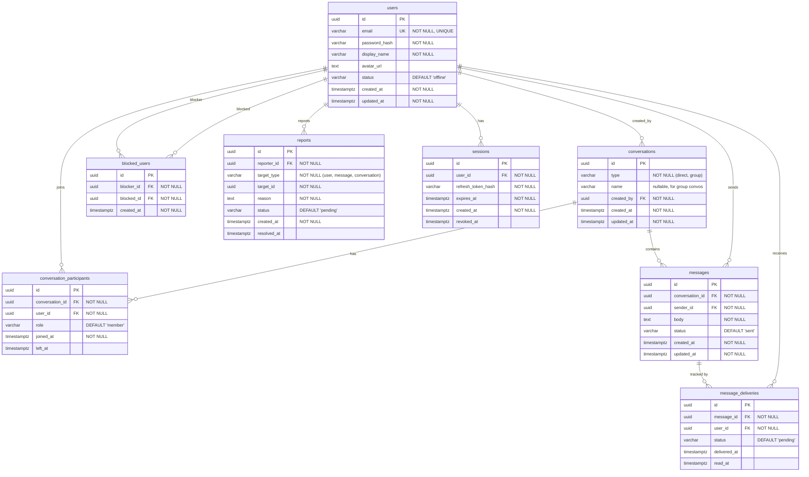

# Database Schema

```mermaid
erDiagram
    users {
        uuid id PK
        varchar email UK "NOT NULL, UNIQUE"
        varchar password_hash "NOT NULL"
        varchar display_name "NOT NULL"
        text avatar_url
        varchar status "DEFAULT 'offline'"
        timestamptz created_at "NOT NULL"
        timestamptz updated_at "NOT NULL"
    }

    conversations {
        uuid id PK
        varchar type "NOT NULL (direct, group)"
        varchar name "nullable, for group convos"
        uuid created_by FK "NOT NULL"
        timestamptz created_at "NOT NULL"
        timestamptz updated_at "NOT NULL"
    }

    conversation_participants {
        uuid id PK
        uuid conversation_id FK "NOT NULL"
        uuid user_id FK "NOT NULL"
        varchar role "DEFAULT 'member'"
        timestamptz joined_at "NOT NULL"
        timestamptz left_at
    }

    messages {
        uuid id PK
        uuid conversation_id FK "NOT NULL"
        uuid sender_id FK "NOT NULL"
        text body "NOT NULL"
        varchar status "DEFAULT 'sent'"
        timestamptz created_at "NOT NULL"
        timestamptz updated_at "NOT NULL"
    }

    message_deliveries {
        uuid id PK
        uuid message_id FK "NOT NULL"
        uuid user_id FK "NOT NULL"
        varchar status "DEFAULT 'pending'"
        timestamptz delivered_at
        timestamptz read_at
    }

    blocked_users {
        uuid id PK
        uuid blocker_id FK "NOT NULL"
        uuid blocked_id FK "NOT NULL"
        timestamptz created_at "NOT NULL"
    }

    reports {
        uuid id PK
        uuid reporter_id FK "NOT NULL"
        varchar target_type "NOT NULL (user, message, conversation)"
        uuid target_id "NOT NULL"
        text reason "NOT NULL"
        varchar status "DEFAULT 'pending'"
        timestamptz created_at "NOT NULL"
        timestamptz resolved_at
    }

    sessions {
        uuid id PK
        uuid user_id FK "NOT NULL"
        varchar refresh_token_hash "NOT NULL"
        timestamptz expires_at "NOT NULL"
        timestamptz created_at "NOT NULL"
        timestamptz revoked_at
    }

    users ||--o{ conversations : "created_by"
    users ||--o{ conversation_participants : "joins"
    conversations ||--o{ conversation_participants : "has"
    conversations ||--o{ messages : "contains"
    users ||--o{ messages : "sends"
    messages ||--o{ message_deliveries : "tracked by"
    users ||--o{ message_deliveries : "receives"
    users ||--o{ blocked_users : "blocker"
    users ||--o{ blocked_users : "blocked"
    users ||--o{ reports : "reports"
    users ||--o{ sessions : "has"
```
