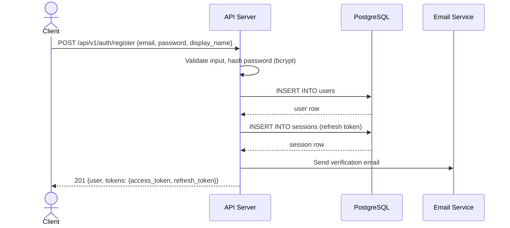
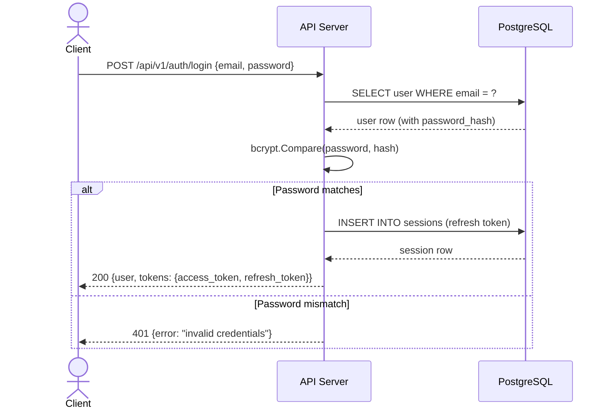
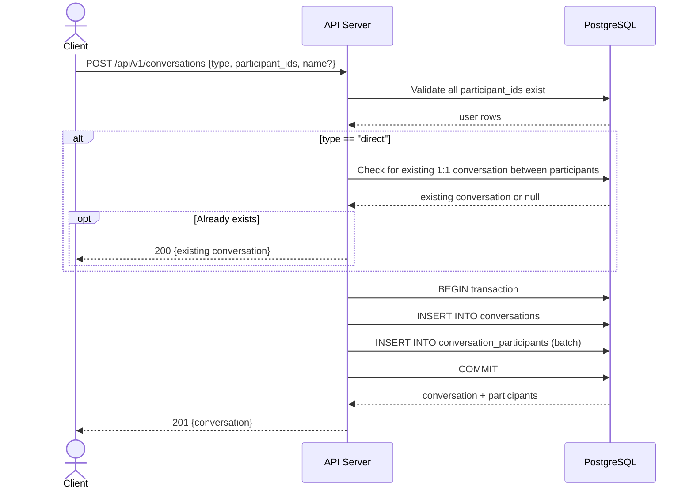
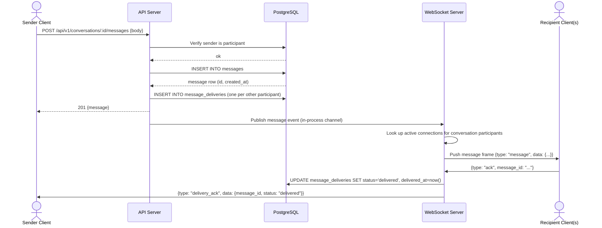
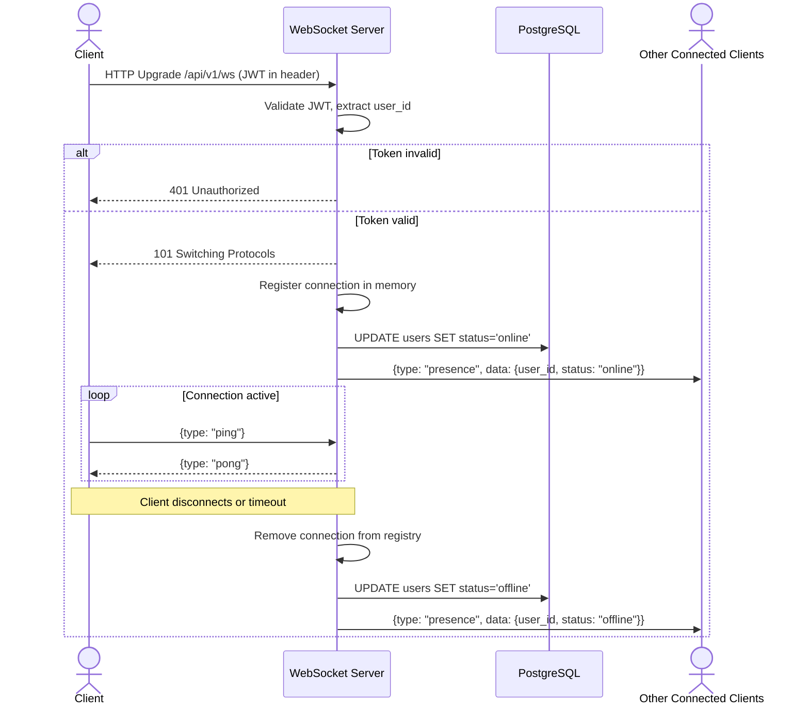
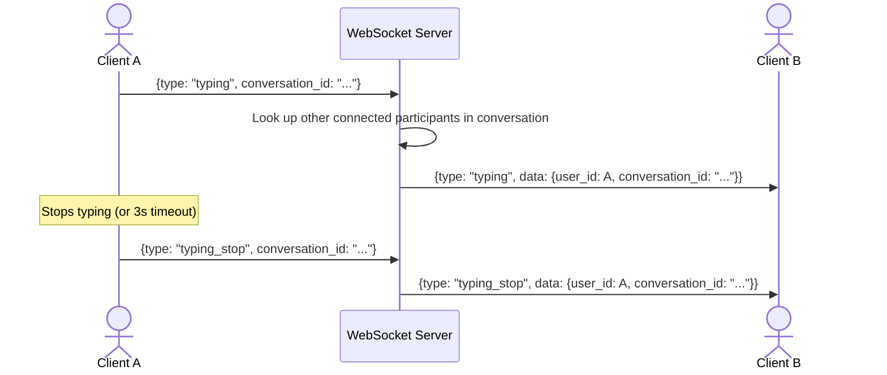

# Workflow Diagrams

## User Registration

```mermaid
sequenceDiagram
    actor Client
    participant API as API Server
    participant DB as PostgreSQL
    participant Email as Email Service

    Client->>API: POST /api/v1/auth/register {email, password, display_name}
    API->>API: Validate input, hash password (bcrypt)
    API->>DB: INSERT INTO users
    DB-->>API: user row
    API->>DB: INSERT INTO sessions (refresh token)
    DB-->>API: session row
    API->>Email: Send verification email
    API-->>Client: 201 {user, tokens: {access_token, refresh_token}}
```

## User Login

```mermaid
sequenceDiagram
    actor Client
    participant API as API Server
    participant DB as PostgreSQL

    Client->>API: POST /api/v1/auth/login {email, password}
    API->>DB: SELECT user WHERE email = ?
    DB-->>API: user row (with password_hash)
    API->>API: bcrypt.Compare(password, hash)
    alt Password matches
        API->>DB: INSERT INTO sessions (refresh token)
        DB-->>API: session row
        API-->>Client: 200 {user, tokens: {access_token, refresh_token}}
    else Password mismatch
        API-->>Client: 401 {error: "invalid credentials"}
    end
```

## Create Conversation

```mermaid
sequenceDiagram
    actor Client
    participant API as API Server
    participant DB as PostgreSQL

    Client->>API: POST /api/v1/conversations {type, participant_ids, name?}
    API->>DB: Validate all participant_ids exist
    DB-->>API: user rows

    alt type == "direct"
        API->>DB: Check for existing 1:1 conversation between participants
        DB-->>API: existing conversation or null
        opt Already exists
            API-->>Client: 200 {existing conversation}
        end
    end

    API->>DB: BEGIN transaction
    API->>DB: INSERT INTO conversations
    API->>DB: INSERT INTO conversation_participants (batch)
    API->>DB: COMMIT
    DB-->>API: conversation + participants
    API-->>Client: 201 {conversation}
```

## Send Message

```mermaid
sequenceDiagram
    actor Sender as Sender Client
    participant API as API Server
    participant DB as PostgreSQL
    participant WS as WebSocket Server
    actor Recipient as Recipient Client(s)

    Sender->>API: POST /api/v1/conversations/:id/messages {body}
    API->>DB: Verify sender is participant
    DB-->>API: ok
    API->>DB: INSERT INTO messages
    DB-->>API: message row (id, created_at)
    API->>DB: INSERT INTO message_deliveries (one per other participant)
    API-->>Sender: 201 {message}

    API->>WS: Publish message event (in-process channel)
    WS->>WS: Look up active connections for conversation participants
    WS->>Recipient: Push message frame {type: "message", data: {...}}
    Recipient->>WS: {type: "ack", message_id: "..."}
    WS->>DB: UPDATE message_deliveries SET status='delivered', delivered_at=now()
    WS->>Sender: {type: "delivery_ack", data: {message_id, status: "delivered"}}
```

## WebSocket Connection Lifecycle

```mermaid
sequenceDiagram
    actor Client
    participant WS as WebSocket Server
    participant DB as PostgreSQL
    actor Others as Other Connected Clients

    Client->>WS: HTTP Upgrade /api/v1/ws (JWT in header)
    WS->>WS: Validate JWT, extract user_id
    alt Token invalid
        WS-->>Client: 401 Unauthorized
    else Token valid
        WS-->>Client: 101 Switching Protocols
        WS->>WS: Register connection in memory
        WS->>DB: UPDATE users SET status='online'
        WS->>Others: {type: "presence", data: {user_id, status: "online"}}

        loop Connection active
            Client->>WS: {type: "ping"}
            WS-->>Client: {type: "pong"}
        end

        Note over Client,WS: Client disconnects or timeout
        WS->>WS: Remove connection from registry
        WS->>DB: UPDATE users SET status='offline'
        WS->>Others: {type: "presence", data: {user_id, status: "offline"}}
    end
```

## Typing Indicators

```mermaid
sequenceDiagram
    actor A as Client A
    participant WS as WebSocket Server
    actor B as Client B

    A->>WS: {type: "typing", conversation_id: "..."}
    WS->>WS: Look up other connected participants in conversation
    WS->>B: {type: "typing", data: {user_id: A, conversation_id: "..."}}

    Note over A: Stops typing (or 3s timeout)
    A->>WS: {type: "typing_stop", conversation_id: "..."}
    WS->>B: {type: "typing_stop", data: {user_id: A, conversation_id: "..."}}
```
