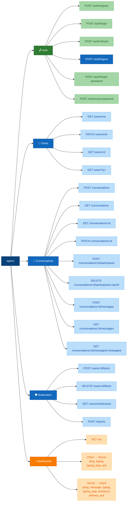

# API Route Map (example)

```mermaid
graph LR
    root["/api/v1"]

    root --> auth["🔓 Auth"]
    root --> users["👤 Users"]
    root --> convos["💬 Conversations"]
    root --> mod["🛡️ Moderation"]
    root --> ws["⚡ WebSocket"]

    auth --> auth_register["POST /auth/register"]
    auth --> auth_login["POST /auth/login"]
    auth --> auth_refresh["POST /auth/refresh"]
    auth --> auth_logout["POST /auth/logout"]
    auth --> auth_forgot["POST /auth/forgot-password"]
    auth --> auth_reset["POST /auth/reset-password"]

    users --> users_me["GET /users/me"]
    users --> users_me_patch["PATCH /users/me"]
    users --> users_id["GET /users/:id"]
    users --> users_search["GET /users?q="]

    convos --> convos_create["POST /conversations"]
    convos --> convos_list["GET /conversations"]
    convos --> convos_get["GET /conversations/:id"]
    convos --> convos_patch["PATCH /conversations/:id"]
    convos --> convos_add["POST /conversations/:id/participants"]
    convos --> convos_remove["DELETE /conversations/:id/participants/:userId"]
    convos --> msg_send["POST /conversations/:id/messages"]
    convos --> msg_list["GET /conversations/:id/messages"]
    convos --> msg_get["GET /conversations/:id/messages/:messageId"]

    mod --> mod_block["POST /users/:id/block"]
    mod --> mod_unblock["DELETE /users/:id/block"]
    mod --> mod_blocked["GET /users/me/blocked"]
    mod --> mod_report["POST /reports"]

    ws --> ws_connect["GET /ws"]
    ws --> ws_inbound["Client → Server<br/>ping, typing,<br/>typing_stop, ack"]
    ws --> ws_outbound["Server → Client<br/>pong, message, typing,<br/>typing_stop, presence,<br/>delivery_ack"]

    %% Styles — public auth endpoints
    style root fill:#08427b,stroke:#052e56,color:#fff
    style auth fill:#2e7d32,stroke:#1b5e20,color:#fff
    style auth_register fill:#a5d6a7,stroke:#66bb6a,color:#1b5e20
    style auth_login fill:#a5d6a7,stroke:#66bb6a,color:#1b5e20
    style auth_refresh fill:#a5d6a7,stroke:#66bb6a,color:#1b5e20
    style auth_forgot fill:#a5d6a7,stroke:#66bb6a,color:#1b5e20
    style auth_reset fill:#a5d6a7,stroke:#66bb6a,color:#1b5e20
    style auth_logout fill:#1168bd,stroke:#0b4884,color:#fff

    %% Styles — authenticated resource groups
    style users fill:#1168bd,stroke:#0b4884,color:#fff
    style convos fill:#1168bd,stroke:#0b4884,color:#fff
    style mod fill:#1168bd,stroke:#0b4884,color:#fff

    %% Styles — authenticated endpoints
    style users_me fill:#bbdefb,stroke:#64b5f6,color:#0d47a1
    style users_me_patch fill:#bbdefb,stroke:#64b5f6,color:#0d47a1
    style users_id fill:#bbdefb,stroke:#64b5f6,color:#0d47a1
    style users_search fill:#bbdefb,stroke:#64b5f6,color:#0d47a1
    style convos_create fill:#bbdefb,stroke:#64b5f6,color:#0d47a1
    style convos_list fill:#bbdefb,stroke:#64b5f6,color:#0d47a1
    style convos_get fill:#bbdefb,stroke:#64b5f6,color:#0d47a1
    style convos_patch fill:#bbdefb,stroke:#64b5f6,color:#0d47a1
    style convos_add fill:#bbdefb,stroke:#64b5f6,color:#0d47a1
    style convos_remove fill:#bbdefb,stroke:#64b5f6,color:#0d47a1
    style msg_send fill:#bbdefb,stroke:#64b5f6,color:#0d47a1
    style msg_list fill:#bbdefb,stroke:#64b5f6,color:#0d47a1
    style msg_get fill:#bbdefb,stroke:#64b5f6,color:#0d47a1
    style mod_block fill:#bbdefb,stroke:#64b5f6,color:#0d47a1
    style mod_unblock fill:#bbdefb,stroke:#64b5f6,color:#0d47a1
    style mod_blocked fill:#bbdefb,stroke:#64b5f6,color:#0d47a1
    style mod_report fill:#bbdefb,stroke:#64b5f6,color:#0d47a1

    %% Styles — WebSocket
    style ws fill:#f57c00,stroke:#e65100,color:#fff
    style ws_connect fill:#ffe0b2,stroke:#ffb74d,color:#e65100
    style ws_inbound fill:#ffe0b2,stroke:#ffb74d,color:#e65100
    style ws_outbound fill:#ffe0b2,stroke:#ffb74d,color:#e65100
```

**Legend:**
- 🟢 Green — public endpoints (no auth required)
- 🔵 Blue — authenticated endpoints (Bearer JWT)
- 🟠 Orange — WebSocket (persistent connection)
